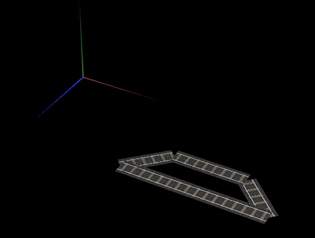
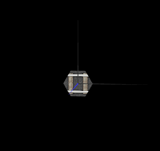
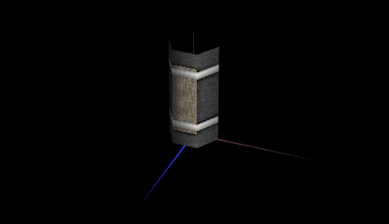
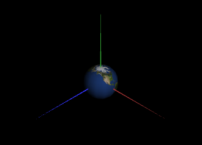
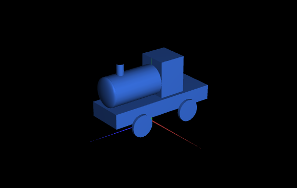
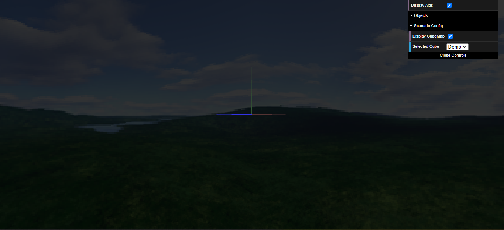
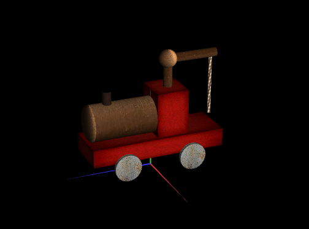
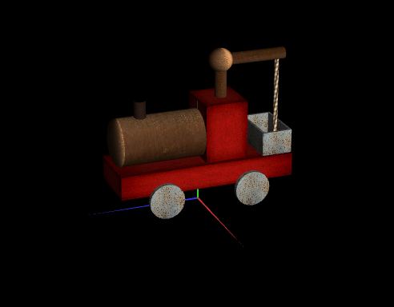
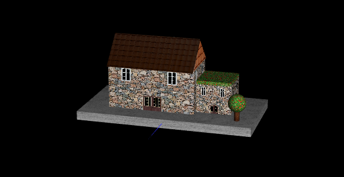
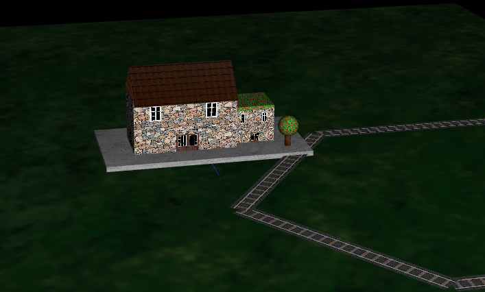

# CGRA 2021/2022

## Group T09G09

| Name             | Number    | E-Mail             |
| ---------------- | --------- | ------------------ |
| Ana Sofia de Castro Teixeira | 201906031 | <up201906031@up.pt> |
| Diogo Miguel Oliveira de Sousa | 201804265 | <up201804265@up.pt> |

## Project Notes

#### Point 1
- At this point, we had some difficulties in applying the texture. This happend because the texture was stretched instead of repeating itself.

#### Point 2
- At the point 2.5, we had some difficulties in creating the sides of the cylinder in MyCylinder.js.
- At the remaining points, we didn't have difficulties.

#### Point 3

#### Point 5

- At this point, we didn't do the crane animation due to lack of time and not quite understanding how to do it.
- Despite not having the animation, we did the display of the crane.

#### Point 6

- At this point, due to lack of time and after many tries, we couldn't implement the station to be on every point that represents a station without it being hard coded.

- Screenshot of the final scene:

#### Point 7

- Due to lack of time, we were unable to implement any of the features presented at this point.