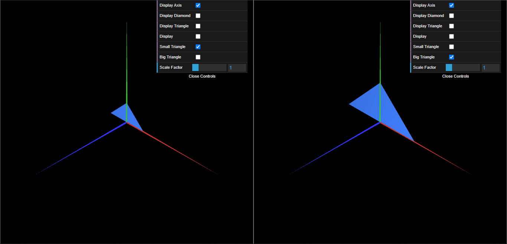

# CGRA 2021/2022

## Group T09G09

## TP 1 Notes

- In exercise 1 we observed how we can construct different geometric shapes from triangles. We also saw how to create checkboxes to display the different shapes.
- In exercise 2 we didn't have difficulties.

