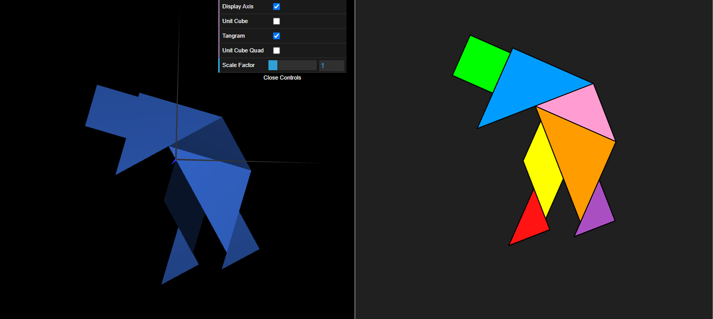
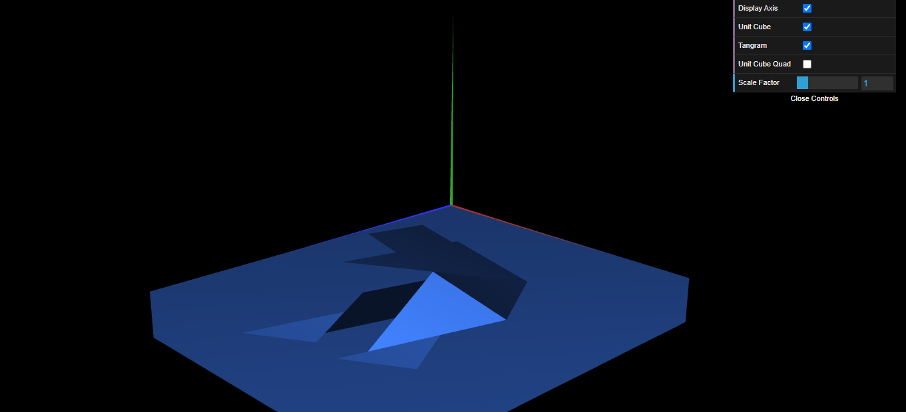
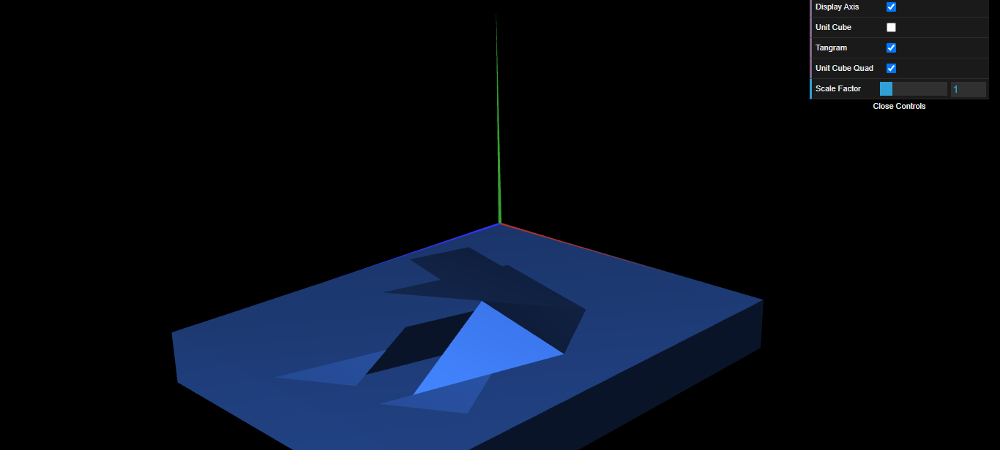

# CGRA 2021/2022

## Group T09G09

## TP 2 Notes

### WebCGF functions for geometric transformations
- In this exercice, although creating the tangram figure on the MyScene class was easy, we had some trouble creating the class MyTangram and move the code.

### Three-dimensional geometry - Unit Cube
- In this exercise 2 we didn't have difficulties.

### Composite geometry - Cube composed of planes
- In this exercise we didn't have difficulties.

