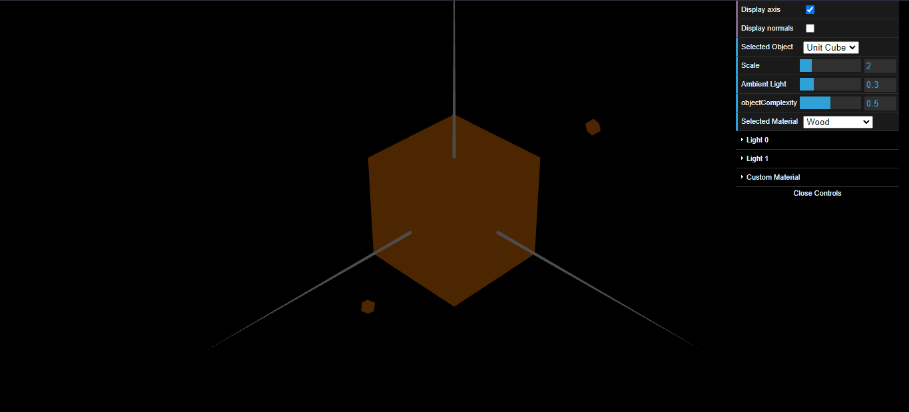
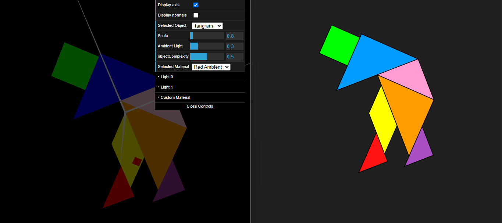

# CGRA 2021/2022

## Group T09G09

## TP 3 Notes

- In this exercice we had some difficulty in declaring the normals, more specifically in the unit cube. We also initially had some difficulty in defining the colors for the different pieces but we managed to understand the process.

