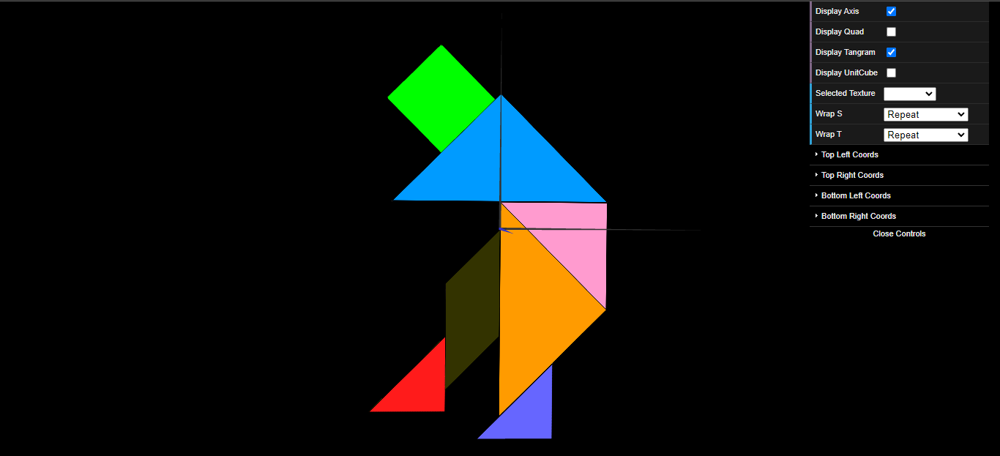
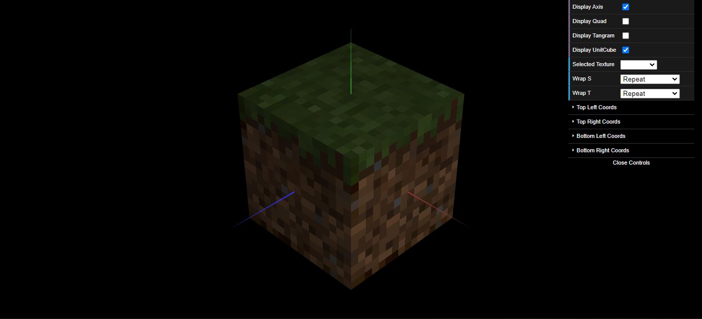

# CGRA 2021/2022

## Group T09G09

## TP 4 Notes

- In exercises 1 to 3, the main difficulty was understanding where the code of the texture would be placed.

- In exercises 4 to 7, we didn't have difficulties but we were confused about exercise 5. We were able to aply the linear filtering to each texture of the UnitCubeQuad.

